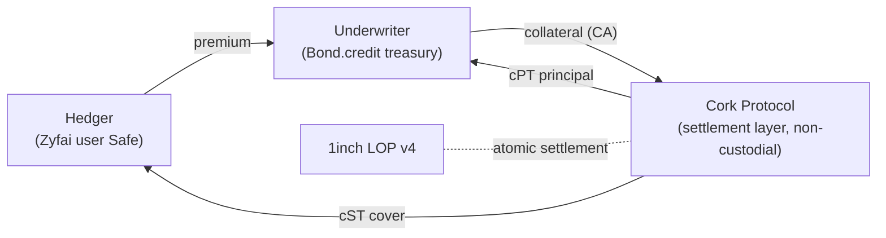

# Task: Build a Google Slides deck — "How the Underwriter and Hedger interact in Cork Protocol"

You are creating a Google Slides presentation. Research **cork.tech**, **docs.cork.tech**, and **api-phoenix.cork.tech/v1/pools/** to confirm current terminology, addresses, and links, then build the deck to the structure below. Use architecture diagrams (Google Slides diagram shapes, or describe a Mermaid diagram in speaker notes for a human to render), keep body text sparse, and place a **Cork CLI (`ch`) example** on every workflow step.

Before you build anything, read the **Context Pack**. It contains ground truth you must not contradict. If live docs disagree with it, prefer the live docs and flag the difference in speaker notes.

> **Every CLI example below was executed against live Arbitrum (chainId 42161) on 2026-07-29** and returns the state noted next to it. Reads, math, decode, and the unsigned builders return `ok`. The signature/venue-dependent commands (submit, fill, reconcile of a specific hash) return an honest non-`ok` envelope until fed real signed input — that is expected and is called out per step.
>
> A command containing a `0x<HEDGER>` / `0x<UNDERWRITER>` / `0x<ORDERHASH>` placeholder is the party's own wallet or a run-specific value: substitute a real value and it returns the noted state (each was verified with a real address/pool in place — the pool, cST/cPT, CA/REF, and oracle addresses shown are already real and run verbatim).

---

## CONTEXT PACK (ground truth — read first)

### What Cork Protocol is
Cork is a decentralized protocol for **credit-risk and duration-risk markets** on tokenized assets (liquid staking tokens, lending/vault tokens, LP tokens, real-world-asset tokens). A market is a pairing of two distinct assets:
- **Reference Asset (REF)** — the asset whose risk is being hedged.
- **Collateral Asset (CA)** — the asset paid out to the hedger when coverage is exercised.

Coverage does **not** pay on a discrete "default" event. It pays the **impairment gap** — the difference between the pool's held exchange rate and the Reference Asset's real value over the market's life, bounded by the oracle's rate caps. This is what lets Cork cover *both* credit events (an asset losing value) and *duration risk* (withdrawal queues, redemption delays, maturity — value you can't access at par when you need it).

Three market **modes**: Liquidity-Only, **Liquidity + Impairment** (the priced-risk mode, ~0.5–4% annualized premium), and Synthetic Payout.

### The two tokens (CRITICAL — get these right)
When collateral is deposited, a Cork pool mints two paired tokens. The structural identity **cPT + cST = Collateral Asset** holds before expiry.

| Token | CLI/field name | Held by | Role |
|---|---|---|---|
| **Cork Swap Token (cST)** — *this is the "Cork Cover Token"* | `corkSwapToken` | **Hedger** | The protection/cover leg. Fungible, transferable ERC-20. Exercised on impairment. |
| **Cork Principal Token (cPT)** | `corkPrincipalToken` | **Underwriter** | The principal/yield leg. Accrues the premium; matures at expiry. |

> Note for the deck: your outline says "Cork Cover Tokens." In Cork's contracts and the CLI that instrument is the **Cork Swap Token (cST)**. Use "Cork Cover Token (cST)" so both names appear once, then be consistent.

The **premium** is the price of cST optionality; it accrues as yield to the cPT-holding underwriters.

### The two roles in THIS pilot (non-custodial architecture)
- **Hedger = Zyfai users' wallets.** Each is a per-user Safe smart-account; the user's own key retains custody until settlement. Buys protection.
- **Underwriter = Bond.credit's managed treasury/vaults.** Supplies underwriting capital (the Collateral Asset). Sells protection.
- **Cork = settlement layer only.** It never takes custody; assets move atomically at settlement. Quotes are matched off-chain via a Phoenix order book and settled on-chain through the **1inch Limit Order Protocol (LOP) v4**.

### Incentive contrast (for the "Why become a…" slides)
- **Underwriter** earns premium up front. Downside: principal (CA) is **locked until maturity** unless they exit early by buying back the outstanding cover; principal can take impairment loss **up to the coverage floor** if the hedger exercises.
- **Hedger** gets downside protection + the right to convert an impaired REF asset into the CA at a fixed strike. Downside: if no impairment occurs, the premium paid is a pure cost (unused insurance) — the mirror image of the underwriter's "collect premium, never pay a claim" upside.

### The Cork CLI (`ch`) — mental model for your examples
`ch` is a helper CLI over the Cork "Phoenix" tooling (also available as an MCP server). The nine commands map to intent:

| Command | What it does |
|---|---|
| `ch capabilities` | Discover/introspect the tools; `--search <kw>` finds the right one. |
| `ch query` | **State reads** — markets, pools, balances, RFQs, registry assets/oracles/recipes, order book, flows. |
| `ch compute` | **Deterministic math** — swap/unwind rate, premium floor, impairment floor (bit-exact vs chain). |
| `ch decode` | Bytes → labeled JSON (calldata, 1inch order, event log, tx receipt). |
| `ch prepare phoenix` | Build an **unsigned** bundle for a pool action (deposit, swap/exercise, unwind, redeem, withdraw…). |
| `ch prepare orders` | Build **unsigned** 1inch maker orders / fills / the rollover intent. |
| `ch prepare market` | Build the **unsigned** permissionless oracle-deploy tx for a new pair. |
| `ch track` | Verify / simulate (dry-run before signing) / reconcile a tx or order to a lifecycle state. |
| `ch submit` | The **only** command that talks to the venue — relays a payload the caller already signed. |

**The one invariant to teach in the deck: prepare ≠ sign ≠ submit.** `ch prepare *` returns unsigned bytes or typed-data. The wallet (Zyfai's Safe, Bond's treasury) signs. `ch submit` only relays what was already signed. The CLI **never holds keys and never signs** — this is what keeps the flow non-custodial.

### CLI input & output conventions (validated 2026-07-29 — READ before writing examples)
Input arrives three ways and they compose (later wins): schema-derived **flags** (the clean path), `--input '<json>'`, or `--json '<json>'`. **Prefer flags.** The mapping is mechanical:

- **The leading identifier is a positional argument** (the tool's first required scalar):
  - reads/decode/track: the resource / kind / mode → `ch query registry-assets`, `ch decode calldata`, `ch track reconcile`.
  - builders: the chain id → `ch prepare phoenix 42161`, `ch prepare market 42161`, `ch submit 42161`.
- **Scalar params are flags:** `--chainid` (on query/compute/track), `--mode`, `--format`, `--maxpages`, `--pagesize`, `--cursor`, `--clientrequestid`, `--fundingmode`, `--deadlineseconds`. Spelling is tolerant — `--chain-id`, `--chainId`, `--chainid` all resolve to the same option.
- **Structured params stay JSON, inside their own flag** — they are discriminated unions / nested objects / typed addresses, so no flat flag exists by design: `--filters '{...}'`, `--params '{...}'`, `--action '{...}'`, `--subject '{...}'`, `--expect '{...}'`, and the two typed scalars `--account '"0x…"'` and `--data '"0x…"'` (JSON-quote the hex/address string).
- **Two gotchas** (both cause a hard `invalid_input`): `--clientrequestid` must be **≥ 8 characters**; `--account`/`--data` values must be **JSON-quoted** (`'"0x…"'`, not bare `0x…`).
- **Output** is human-readable prose by default; add a **bare `--json`** (no value) for machine JSON. Exit codes for scripting: `0` ok · `2` invalid input · `3` unavailable · `4` conflict · `1` error.

Reading the result: every command returns an envelope with a `state` — `ok` (use it), `unavailable` (honest "can't serve this now," reason in the first warning), or `conflict` (a mismatch was found). Amounts are **base-unit decimal strings**, never floats — 1.0 of an 18-decimal token is `"1000000000000000000"`, 1.0 USDC (6 decimals) is `"1000000"`.

### Live validation fixture (real, on Arbitrum — copy these to make examples run)
- **Chain:** Arbitrum One = `42161` (production Phoenix chain). Mainnet = `1`.
- **Live pool** (current pool-manager, readable today): `sUSDe-waArbUSDT-21AUG2026` = `0xd68978649ebc410d7f1825cae666483d300ca4e6905531df029687d2c19fe259`
  - Collateral Asset (CA) = **sUSDe** `0x211Cc4DD073734dA055fbF44a2b4667d5E5fE5d2`
  - Reference Asset (REF) = **waArbUSDT** `0xa6d12574efb239fc1d2099732bd8b5dc6306897f`
  - Cork Swap Token (cST) = `0x3101A2a21A6981d3E715191Eab11B69dEf907338`
  - Cork Principal Token (cPT) = `0xD413d276875b002f48C34104BD5471dca656706b`
- **Oracle-pair for the deploy/predict examples** (oracle already deployed): collateral sUSDe `0x211Cc4DD073734dA055fbF44a2b4667d5E5fE5d2` / reference USDe `0x7F6501d3B98eE91f9b9535E4b0ac710Fb0f9e0bc`.
- **Registry recipe modes** (case-sensitive): `liquidity`, `fixed`. (RFQ `modes` are a *different* vocabulary: `liquidity_only` / `liquidity_impairment`.)
- **1inch LOP v4:** `0x111111125421ca6dc452d289314280a0f8842a65`. **Rollover settler (ExactSettler):** `0x983270AE48545665Cee4D7EF61C65fF3fdC8222D`.
- A **demo holder** address for read examples: `0xc0ffee0000000000000000000000000000000001`. Where a slide represents the party's own wallet, keep `0x<HEDGER>` / `0x<UNDERWRITER>`.
- To list current live pools yourself: `ch query markets --chainid 42161`.

---

## PRESENTATION STRUCTURE

### Section 1 — Introduction to Cork Protocol
- One slide: what Cork is (decentralized credit + duration risk markets on tokenized assets).
- One slide: **credit risk** (a liquid-staking / lending / LP / vault token losing value vs its reference) and **duration risk** (withdrawal queues, redemption delays, maturity). Cork covers both via the **impairment gap**, not a discrete default event.

### Section 2 — Roles & incentives
- Underwriter and Hedger responsibilities (use the Context Pack role + token tables).
- **Slide: Why become an Underwriter?** Benefits: earn premium on every cover sold. Risks: hedger may never exercise (pure premium income *is* the good case for the underwriter); CA principal locked until maturity unless exited early; impairment loss up to the coverage floor. Contrast against the hedger's "pay premium, never claim" downside.
- **Slide: Why become a Hedger?** Benefits: protection against credit events and duration/withdrawal-queue risk; convert impaired REF into CA at a fixed strike on exercise. Risk: premiums paid with no claim = unused insurance. Contrast against the underwriter's principal-loss exposure.

### Section 3 — Non-custodial architecture
One slide with a custody diagram:
- **Hedger** = Zyfai user Safe wallets — retain custody until settlement.
- **Underwriter** = Bond.credit managed treasury/vaults — supply underwriting capital.
- **Cork** = settlement layer only; matching off-chain (Phoenix order book), settling on-chain via **1inch LOP v4**. No party takes custody; the fill is atomic.

*Diagram suggestion (put in speaker notes as Mermaid for a human to render):*


---

## SECTION 4 — HOW IT WORKS (step-by-step; each step = 1–2 slides with a diagram + `ch` example)

> Each command uses flags for every scalar and JSON only where the payload is a discriminated union / address (see the conventions block). The `→ state` tag after each block is the **verified** result when run against live Arbitrum on 2026-07-29. Add a bare `--json` to any command for machine output.

### 1. Verify supported assets  → all `ok`
The hedger picks the REF to hedge and the CA to be paid in. Confirm the pair is supported (registry-approved assets + a rate oracle), and predict the market before it exists.
```sh
# Registry-approved assets on Arbitrum
ch query registry-assets --chainid 42161                                    # → ok

# Rate oracle for this CA/REF pair (deployed / deployable / why-not)
ch query registry-oracle --chainid 42161 \
  --filters '{"collateralAsset":"0x211Cc4DD073734dA055fbF44a2b4667d5E5fE5d2","referenceAsset":"0x7F6501d3B98eE91f9b9535E4b0ac710Fb0f9e0bc"}'   # → ok

# Predict the market that WOULD exist: pool id + cST/cPT + oracle + live rate
ch query market-predict --chainid 42161 \
  --filters '{"collateralAsset":"0x211Cc4DD073734dA055fbF44a2b4667d5E5fE5d2","referenceAsset":"0x7F6501d3B98eE91f9b9535E4b0ac710Fb0f9e0bc","expiry":"1900000000","mode":"liquidity"}'   # → ok

# List existing live pools
ch query markets --chainid 42161                                            # → ok
```

### 2. Whitelist a new asset pair  → `ok` (oracle deploy)
If the pair isn't supported: (a) contact the Cork team to add the assets to the MarketRegistry allowlist, and (b) deploy the pair's rate oracle — **permissionless and idempotent** (safe to send even if it exists). Markets themselves are created just-in-time by the first fill (Step 5), not here.
```sh
# Unsigned oracle-deploy tx for the pair (chainId is the positional arg)
ch prepare market 42161 --clientrequestid oracle-deploy-0001 \
  --action '{"type":"deploy-wrapper","collateralAsset":"0x211Cc4DD073734dA055fbF44a2b4667d5E5fE5d2","referenceAsset":"0x7F6501d3B98eE91f9b9535E4b0ac710Fb0f9e0bc"}'
# → ok (warns oracle_already_deployed for this pair — the tx is a safe no-op; a new pair returns fresh calldata)
```

### 3. Create an RFQ (hedger)  → discovery `ok`; submit needs a real signature
The hedger's bot picks a duration and coverage profile (recipe), then posts a request-for-quote.
```sh
# Underwriters (and you) discover open RFQs
ch query rfqs --chainid 42161 --filters '{"state":"open"}'                  # → ok

# Post the RFQ (chainId positional; signature comes from the hedger's wallet)
ch submit 42161 --clientrequestid rfq-open-0001 \
  --action '{"type":"rfq-open","requester":"0x<HEDGER>","referenceAsset":"0x211Cc4DD073734dA055fbF44a2b4667d5E5fE5d2","collateralAsset":{"one_of":["0xa6d12574efb239fc1d2099732bd8b5dc6306897f"]},"modes":["liquidity_impairment"],"packageIds":["balanced-v1"],"expiryWindow":{"notBefore":1795000000,"notAfter":1795604800},"notionalAssets":"50000000000","validUntil":1794900000,"signature":"0x<SIG>"}'
# → unavailable/venue_rejected until signed with a real key (the CLI reaches the venue and relays; it never signs)
```

### 4. Underwriter responds  → build `ok`; relay needs a real signature
The underwriter returns a quote as a **signed 1inch maker order** (SELL cST cover for the CA premium). If the pool doesn't exist yet, add a `jitMarket` block so the fill creates it just-in-time.
```sh
# Build the signable 1inch maker order (unsigned typed-data)
ch prepare orders 42161 --account '"0x<UNDERWRITER>"' --clientrequestid quote-0001 \
  --action '{"type":"maker-order","poolId":"0xd68978649ebc410d7f1825cae666483d300ca4e6905531df029687d2c19fe259","side":"SELL","makerAsset":"0x3101A2a21A6981d3E715191Eab11B69dEf907338","takerAsset":"0x211Cc4DD073734dA055fbF44a2b4667d5E5fE5d2","makingAmount":"1000000000000000000","takingAmount":"41000000000000000","expirySeconds":86400}'
# → ok (returns EIP-712 typed-data; the underwriter signs it in their wallet, NOT the CLI)

# Relay the signed order to the venue order book — COMPLETE payload (real order + real signature).
# The `order` object + `orderHash` are the verbatim output of the `prepare orders maker-order` above;
# `signature` is the maker wallet's EIP-712 signature over that typed-data (here: Anvil test key #0).
# Rule: listing `expiry`/`nonce`/`allowsPartialFills` MUST equal what the signed `makerTraits`
# encodes — `ch decode order --data '{...}'` shows those (this makerTraits encodes expiry 1785411837,
# nonce 0, allowPartialFills true). orderHash = 0x6640ec94f880a1c8e623ba2ddfd6e2b55d7ba769dc363caa219273301cf5ac70
ch submit 42161 --clientrequestid quote-0001 --action '{
  "type":"lop-order",
  "order":{
    "salt":"311261764820152864471288446006018145946265269654",
    "maker":"0xf39Fd6e51aad88F6F4ce6aB8827279cffFb92266",
    "receiver":"0x0000000000000000000000000000000000000000",
    "makerAsset":"0x3101A2a21A6981d3E715191Eab11B69dEf907338",
    "takerAsset":"0x211Cc4DD073734dA055fbF44a2b4667d5E5fE5d2",
    "makingAmount":"1000000000000000000",
    "takingAmount":"41000000000000000",
    "makerTraits":"2158430468394885706885947627405312"
  },
  "signature":"0x7c9c3786c25e88ea224cd5a0a9ce6c57c8860b1e5744684e6f0c4f5b88aa5525294ed295258e1d3efa46d8f380ed4a80447864f1802731a5f9c518162149da691b",
  "side":"SELL","premium":4.1,"expiry":1785411837,"nonce":"0","allowsPartialFills":true
}'
# Verified: the local K3 signature-recovery + listing/traits-consistency checks PASS, and the payload
# reaches the venue. The venue then applies its own rules (a real-EOA-or-ERC1271 maker, a future
# expiry) — so a live post needs your own maker address + a fresh future expiry, not this demo key.
```

### 5. Hedger accepts the quote  → discovery `ok`; fill needs a real resting order
The hedger discovers the resting order, builds the fill, simulates it, then signs and broadcasts.
```sh
# Find resting orders (bounded venue traversal); take an orderHash from the result
ch query orderbook --chainid 42161 --maxpages 1                             # → ok

# Build UNSIGNED fill calldata for a real resting order (hash from the orderbook above).
# The account 0xc0ffee…01 is a demo holder — substitute the hedger's own wallet.
ch prepare orders 42161 --account '"0xc0ffee0000000000000000000000000000000001"' --clientrequestid fill-0001 \
  --action '{"type":"taker-fill","orderHash":"0xe2b67c02022118bb93bab230e110258425da5b57c8ae6052113032700ec40510"}'
# → ok  (returns unsigned fill calldata; warns unsigned_artifact — simulate + set the taker-asset
#         allowance before broadcast. order_not_found if the hash isn't on the venue.)
```
```sh
# Dry-run the frozen bytes before broadcast. bundler3 + multicall are the verbatim fields from a
# `prepare phoenix` result (here: the Step 8 swap bundle). would_revert here is expected — the demo
# account is unfunded; a funded account with allowances set simulates clean.
ch track simulate --chainid 42161 --subject '{
  "kind":"artifact",
  "artifact":{
    "bundler3":"0x1FA4431bC113D308beE1d46B0e98Cb805FB48C13",
    "account":"0xc0ffee0000000000000000000000000000000001",
    "multicall":"0x374f435d000000000000000000000000000000000000000000000000000000000000002000000000000000000000000000000000000000000000000000000000000000010000000000000000000000000000000000000000000000000000000000000020000000000000000000000000e9f364dfcc358dc745ff7c54cb087ae2520f1bed00000000000000000000000000000000000000000000000000000000000000a000000000000000000000000000000000000000000000000000000000000000000000000000000000000000000000000000000000000000000000000000000000000000000000000000000000000000000000000000000000000000000000000000000000000000000000000000000000000000000000000000000000000000c4d5f2e59ed68978649ebc410d7f1825cae666483d300ca4e6905531df029687d2c19fe2590000000000000000000000000000000000000000000000000de0b6b3a7640000000000000000000000000000c0ffee00000000000000000000000000000000010000000000000000000000000000000000000000000000001bc16d674ec800000000000000000000000000000000000000000000000000001bc16d674ec80000000000000000000000000000000000000000000000000000000000006a69f29000000000000000000000000000000000000000000000000000000000"
  }
}'
# → ok  (reports wouldRevert + reason). The hedger then signs & broadcasts the fill tx from their Safe.
```

### 6. Settlement  → reconcile/decode `ok` given a real tx
On the fill, one atomic settlement runs a just-in-time mint: the underwriter's **CA is locked in Cork**, **cPT is minted to the underwriter**, the **premium moves hedger → underwriter**, and **cST cover is minted to the hedger**.
```sh
# Reconcile the settlement tx (mode is the positional arg)
ch track reconcile --chainid 42161 --subject '{"kind":"txHash","txHash":"0x<TX>"}'
# → ok for a real settlement tx; unavailable/receipt_not_found for an unknown hash

# Decode the receipt into labeled Cork legs (each log labeled against the ABI set). This is the REAL
# Arbitrum receipt of tx 0x256414d9…249316 — the settlement of the order filled in Step 5 — and
# decodes to exactly the three settlement legs: cST Transfer (cover to the hedger), CA Transfer
# (premium to the underwriter), and the 1inch OrderFilled event.
ch decode receipt --data '{"status":"0x1","logs":[{"address":"0xd1f71c26cc66938b789b23615fe554f6fce835f8","topics":["0xddf252ad1be2c89b69c2b068fc378daa952ba7f163c4a11628f55a4df523b3ef","0x000000000000000000000000d2f5f275a03341f4c50d3a3b4ab2c60e420b18d0","0x000000000000000000000000ce056d0e651c9bc58d0c9a9c14969987d9b6f517"],"data":"0x000000000000000000000000000000000000000000000000000071afcd2576c0"},{"address":"0x211cc4dd073734da055fbf44a2b4667d5e5fe5d2","topics":["0xddf252ad1be2c89b69c2b068fc378daa952ba7f163c4a11628f55a4df523b3ef","0x000000000000000000000000ce056d0e651c9bc58d0c9a9c14969987d9b6f517","0x000000000000000000000000d2f5f275a03341f4c50d3a3b4ab2c60e420b18d0"],"data":"0x000000000000000000000000000000000000000000000000000000000091233b"},{"address":"0x111111125421ca6dc452d289314280a0f8842a65","topics":["0xfec331350fce78ba658e082a71da20ac9f8d798a99b3c79681c8440cbfe77e07"],"data":"0xe2b67c02022118bb93bab230e110258425da5b57c8ae6052113032700ec405100000000000000000000000000000000000000000000000000000000000000000"}]}'
# → ok  (labels: Transfer @ dstCST, Transfer @ sUSDe, OrderFilled @ 1inch LOP)

# Confirm the hedger now holds cST cover
ch query account-state --chainid 42161 \
  --filters '{"poolId":"0xd68978649ebc410d7f1825cae666483d300ca4e6905531df029687d2c19fe259","account":"0x<HEDGER>"}'   # → ok
```
*Diagram: 4 arrows on settlement — CA→Cork(locked), cPT→Underwriter, premium→Underwriter, cST→Hedger.*

### 7. During the coverage period  → all `ok`
Collateral stays locked until maturity. The underwriter can exit early by **buying back the outstanding cST cover** and recombining it with their cPT (identity `cST + cPT = CA`) to unlock collateral. Check the rate first.
```sh
# What does putting collateral back in return right now?
ch compute --chainid 42161 \
  --params '{"kind":"unwind-rate","poolId":"0xd68978649ebc410d7f1825cae666483d300ca4e6905531df029687d2c19fe259","collateralAssetsIn":"1000000000000000000"}'   # → ok

# Build the unsigned unwind bundle
ch prepare phoenix 42161 --account '"0x<UNDERWRITER>"' --clientrequestid unwind-0001 \
  --action '{"type":"unwind-swap","poolId":"0xd68978649ebc410d7f1825cae666483d300ca4e6905531df029687d2c19fe259","collateralAssetsIn":"1000000000000000000","receiver":"0x<UNDERWRITER>","minReferenceAssetsOut":"1","minCstSharesOut":"1"}'
# → ok (add --rpc-url <url> to auto-build funding legs; otherwise warns funding_needs_rpc)
```

### 8. Exercising coverage  → all `ok`
On a credit event or a long withdrawal queue, the hedger exercises the cST: impaired/locked REF is exchanged for the CA at the fixed strike. Exercised REF becomes owned by the cPT holders.
```sh
# Payout rate: cST + reference needed to take 1.0 CA out
ch compute --chainid 42161 \
  --params '{"kind":"cst-swap-rate","poolId":"0xd68978649ebc410d7f1825cae666483d300ca4e6905531df029687d2c19fe259","collateralAssetsOut":"1000000000000000000"}'   # → ok

# Build the unsigned coverage-payout bundle (take exact CA out, capped inputs)
ch prepare phoenix 42161 --account '"0x<HEDGER>"' --clientrequestid exercise-0001 \
  --action '{"type":"swap","poolId":"0xd68978649ebc410d7f1825cae666483d300ca4e6905531df029687d2c19fe259","collateralAssetsOut":"1000000000000000000","receiver":"0x<HEDGER>","maxCstSharesIn":"2000000000000000000","maxReferenceAssetsIn":"2000000000000000000"}'
# → ok (warns funding_needs_rpc without --rpc-url)
```

### 9. Post-event recovery
After an event, arbitrageurs repurchase discounted REF assets, reducing the impairment loss borne by underwriters. No dedicated command; show the asset flow (arbitrageur buys cheap REF → REF recovers toward par → cPT holders' recovered value rises) and a market read:
```sh
ch query market --chainid 42161 \
  --filters '{"poolId":"0xd68978649ebc410d7f1825cae666483d300ca4e6905531df029687d2c19fe259"}'   # → ok
```

### 10. Maturity & redemption  → `ok`
After expiry, cST expires and cPT matures; the underwriter redeems cPT for a pro-rata share of the remaining REF and CA.
```sh
ch prepare phoenix 42161 --account '"0x<UNDERWRITER>"' --clientrequestid redeem-0001 \
  --action '{"type":"redeem","poolId":"0xd68978649ebc410d7f1825cae666483d300ca4e6905531df029687d2c19fe259","cptSharesIn":"1000000000000000000","owner":"0x<UNDERWRITER>","receiver":"0x<UNDERWRITER>","minReferenceAssetsOut":"1","minCollateralAssetsOut":"1"}'
# → ok  (variants: "withdraw" = exact CA out; "withdraw-other" = exact REF out)
```

### 11. (Optional) Offer a rollover  → all `ok`
Before maturity, the underwriter can offer to roll an existing cover into a new series with a later expiry. Check the premium floor, then build the rollover intent.
```sh
# Minimum premium the rollover is guaranteed to earn (pure math, no RPC)
ch compute --params '{"kind":"rollover-premium-floor","dstCstProduced":"1000000000000000000000","minPremiumPerShare":"12000000000000000"}'   # → ok

# Build the signable rollover intent (ERC-7683, CorkSettler domain). Rolls the sUSDe-waArbUSDT cover
# from the 21 Aug series (src) into the 22 Aug series (dst) — two real, distinct live pools; each
# `*CstToken` is that pool's real corkSwapToken. account/rolloverContract 0xc0ffee…01 are demo —
# substitute the underwriter's wallet + rollover contract.
ch prepare orders 42161 --account '"0xc0ffee0000000000000000000000000000000001"' --clientrequestid rollover-0001 \
  --action '{"type":"rollover-intent","settler":"0x983270AE48545665Cee4D7EF61C65fF3fdC8222D","rolloverContract":"0xc0ffee0000000000000000000000000000000001","srcPoolId":"0xd68978649ebc410d7f1825cae666483d300ca4e6905531df029687d2c19fe259","dstPoolId":"0xd1863a37fc99481a2770253b2f20d9d76e5979a25a16f9c3f5ef156e6b8d6487","srcCstToken":"0x3101A2a21A6981d3E715191Eab11B69dEf907338","dstCstToken":"0xd1f71C26Cc66938b789b23615fe554f6Fce835F8","premiumToken":"0x211Cc4DD073734dA055fbF44a2b4667d5E5fE5d2","orderSize":"250000000000000000000","minPremiumPerShare":"12000000000000000","openDeadline":"1795000000","fillDeadline":"1795604800"}'
# → ok (returns typed-data; the underwriter signs it in their wallet)
```

### 12. Hedger accepts the rollover  → relay needs a real signature
The hedger signs the rollover order and submits it to the venue. COMPLETE payload below (canonical demo fixture with a real Anvil-#0 EIP-712 signature over this exact OrderData; addresses are demo fixtures — sUSDe/vbUSDC, a placeholder `rolloverContract` — swap in your real market + wallet).
```sh
ch submit 42161 --clientrequestid rollover-0001 --action '{
  "type":"rollover-order",
  "order":{
    "user":"0xf39Fd6e51aad88F6F4ce6aB8827279cffFb92266",
    "settler":"0x983270AE48545665Cee4D7EF61C65fF3fdC8222D",
    "fillerHint":"0x0000000000000000000000000000000000000000",
    "exclusiveFiller":"0x0000000000000000000000000000000000000000",
    "srcCstToken":"0x9D39A5DE30e57443BfF2A8307A4256c8797A3497",
    "dstCstToken":"0x53E82ABbb12638F09d9e624578ccB666217a765e",
    "premiumToken":"0x9D39A5DE30e57443BfF2A8307A4256c8797A3497",
    "rolloverContract":"0xc0ffee0000000000000000000000000000000001",
    "originChainId":"42161","destinationChainId":"42161",
    "openDeadline":"1795000000","fillDeadline":"1795604800",
    "orderSalt":"8811723641","orderSize":"250000000000000000000",
    "minPremiumPerShare":"12000000000000000",
    "allowPartialFills":false,"allowUnderfill":false,"premiumPaymentMode":0,
    "rolloverIntentHash":"0x93cec2a3f4ee806583f173da81e62a11d0a8b392ec9f1509e5f2228006f52d84",
    "rolloverParams":{
      "srcCstToken":"0x9D39A5DE30e57443BfF2A8307A4256c8797A3497",
      "dstCstToken":"0x53E82ABbb12638F09d9e624578ccB666217a765e",
      "minCaReceived":"0","minSharesOut":"0",
      "srcPoolId":"0x1111111111111111111111111111111111111111111111111111111111111111",
      "dstPoolId":"0x2222222222222222222222222222222222222222222222222222222222222222",
      "settler":"0x983270AE48545665Cee4D7EF61C65fF3fdC8222D"
    }
  },
  "intent":{
    "rolloverContract":"0xc0ffee0000000000000000000000000000000001",
    "deadline":"1795604800","nonce":"1",
    "preRolloverHooks":[],"midRolloverHooks":[],"postRolloverHooks":[],"premiumHooks":[]
  },
  "signature":"0x97ccd3eb8faa84248754800ef050b1ee4ae6f2f073df6f5cf2b28c9bf6478e052af96f77cd1291a576bcdb77ba3bd1df363f4fc4e55624b353b1d99c34e795ea1b"
}'
# Verified: the local K3 checks PASS — the payload's intent re-hashes to its own rolloverIntentHash
# and the orderDigest is recomputed before relay — and it reaches the venue. The venue then runs an
# on-chain ERC-1271 signature check against `rolloverContract`, which the demo placeholder fails; a
# live post uses your real rollover contract + market pool ids.
```

### 13. Rollover settlement  → reconcile given a real digest; flows `ok`
On confirmation, collateral migrates into the new Cork pool, the underwriter's cPT converts to the new maturity, the premium is paid, and the hedger's expiring cST is replaced by a new cST covering the extended duration.
```sh
# Reconcile the rollover order digest to a lifecycle state
ch track reconcile --chainid 42161 --subject '{"kind":"orderHash","orderHash":"0x<DIGEST>"}'
# → ok/lifecycle for a real digest; conflict/pagination_incomplete on an unknown one (bounded venue search, by design)

# See rollover fills/flows
ch query flows --chainid 42161 --filters '{"kind":"fills"}'                 # → ok
```

---

## GETTING STARTED (closing section)

Install and first-run:
```sh
# Prereqs: the CLI runs on Bun (not Node). Pinned via mise.
mise trust && mise install
bun install

# Put bin/ on PATH so the launcher `ch` resolves; then health-check → expect 9 tools
ch capabilities --json | jq '.data.tools | length'    # → 9

# Every command self-documents in plain English:
ch query --explain
ch prepare phoenix --explain
# (add a bare --json, or set CORK_EXPLAIN_JSON=1, for the machine-readable JSON schema instead)

# Find the right command for a task
ch capabilities --search exercise
```

Optional — run it as an MCP server (so an agent like Claude can call the tools directly):
```sh
claude mcp add cork-defi -- "$(mise which bun)" "$(pwd)/packages/mcp/src/bin.ts"
claude mcp list   # expect: cork-defi … ✔ Connected
```

Config & wallet notes for the slide:
- **RPC:** chain reads work out-of-the-box on public chains; override with `--rpc-url <url>` (or `CORK_RPC_URL`) for a private/faster node, or to build funding legs for `prepare phoenix`. Never commit an RPC URL.
- **Wallet:** the CLI never holds keys. `ch prepare *` emits unsigned artifacts; the party's own wallet (Zyfai Safe, Bond treasury) signs; `ch submit` relays. No CLI auth step — trust lives in the signing wallet.
- **Input:** prefer flags; scalars are flags/positional, structured payloads go in a JSON-valued flag (`--action`, `--filters`, `--params`, `--subject`). `--clientrequestid` ≥ 8 chars; JSON-quote `--account`/`--data`. **Output** is prose by default; add a bare `--json` for machine JSON.

Links (verify these are current on the live sites before publishing):
- Cork: **cork.tech** · Docs & Getting Started: **docs.cork.tech**
- Live pools / API: **api-phoenix.cork.tech/v1/pools/**
- 1inch Limit Order Protocol v4 docs (settlement layer Cork builds on).

---

## BUILD REQUIREMENTS FOR THE DECK
- Terminology must match the Context Pack and the latest docs.cork.tech. If they differ, follow the docs and note it.
- Every "How it works" step gets a diagram + the flag-form `ch` example above (all verified live).
- Keep cST vs cPT and Hedger vs Underwriter straight on every slide — this is the #1 way this deck goes wrong.
- Reinforce the through-line: **Cork is a non-custodial settlement layer; the CLI prepares, wallets sign, the venue settles atomically.**
